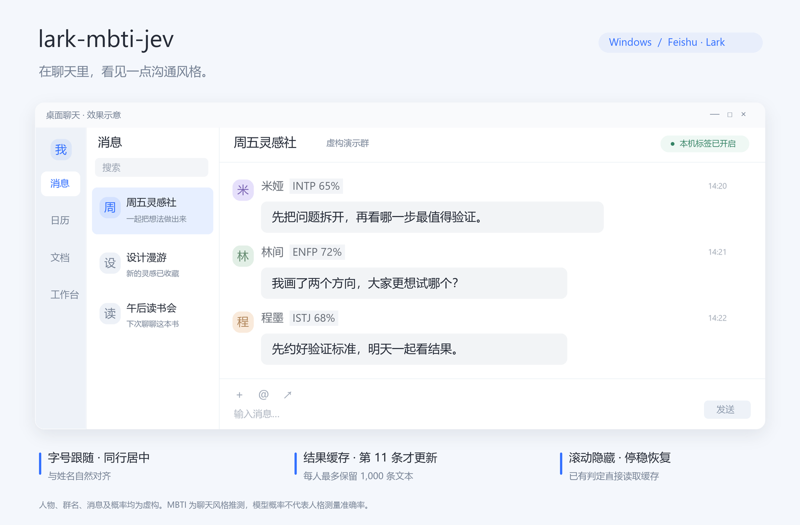

# lark-mbti-jev

一个用于 Windows 飞书 / Lark 群聊的小工具。它让 Jev 根据聊天记录推测成员的 MBTI，并在发言者姓名旁显示结果，例如 **INTP 65%**。标签只在你的电脑上显示。



> 图中的人物、群名、消息和概率均为虚构。本工具独立于飞书运行，由第三方开发。

## 安装和启动

使用前需要准备：

- Windows 10 / 11 和 Python 3.11+。
- Windows 中文文字识别（OCR）语言组件。
- 已配置并登录的 [lark-cli](https://github.com/larksuite/cli)，以及读取所选群聊的权限。
- 可用的 Jev 服务，或用于直连 [TypeSafe](https://docs.typesafe.ai/) 的 API 密钥。

在 PowerShell 中下载并安装：

```powershell
git clone https://github.com/iikawa0918/lark-mbti-jev.git
cd lark-mbti-jev
powershell -NoProfile -ExecutionPolicy Bypass -File .\install.ps1
```

检查 lark-cli 的登录状态：

```powershell
lark-cli auth status --json
```

### 配置 Jev

如果电脑上已经配置了 Jev 中转服务，程序会使用 `JEV_BASE_URL`、`JEV_CLIENT_CONFIG` 或 `~/.agents/jev-client.json`。配置文件中的 `base_url` 填服务根地址，例如 `http://127.0.0.1:8766`；API 密钥由中转服务管理。

如果直接使用 TypeSafe，在当前 PowerShell 窗口设置密钥，再启动程序：

```powershell
$env:TYPESAFE_API_KEY = "替换为你的 TypeSafe API 密钥"
.\.venv\Scripts\python.exe -m feishu_mbti.app
```

也可以把密钥保存在本机文件中，用 `TYPESAFE_KEY_FILE` 指定路径。文件只需一行密钥，或一行 `TYPESAFE_API_KEY=...`。密钥和个人配置留在本机，勿提交到 Git。

配置已保存到用户环境变量或本机配置文件时，可直接双击 `启动飞书MBTI.vbs`。只在当前 PowerShell 窗口设置的变量，需要从同一个窗口运行上面的 Python 启动命令。

程序会在 PATH 和 npm 默认安装目录中查找 lark-cli。安装在其他位置时，用 `LARK_CLI_EXE` 指定可执行文件路径。

### 选择群聊

1. 在控制窗口输入群名，点击“选择群聊”。
2. 从搜索结果中选中目标群，点击“使用此群”。
3. 点击“开启标签”，再点击“在飞书打开”。

第一次使用时需要自己选群。控制窗口可以最小化；关闭它会停止消息读取、姓名识别和鼠标监听。程序需要手动启动。

## 标签怎么显示

- **还没有分析结果的成员**：依次读取此人在当前群里的文本消息，交给 Jev 分析。有文本但信息较少时，仍显示最可能的类型和概率；没有可用文本时显示“暂无文本”。
- **字号和位置**：标签跟随姓名的字号，与姓名垂直居中。姓名后有状态文字或链接时，标签放到这一行的空位；空间不足时隐藏。
- **滚动消息**：滚动或拖动滚动条时隐藏标签，停稳约 0.35 秒后重新识别姓名位置。识别完成后恢复显示，所需时间取决于 OCR 处理速度。
- **切换窗口**：只有选定群聊处于前台时才显示标签。

在控制窗口中双击成员，可以查看四个维度的概率、分析参考了多少条消息，以及上次分析后新增了多少条消息。群昵称识别不准时，选中对应成员，点击“补充群昵称”，填入此人在该群的完整昵称。

## 结果何时更新

同一个成员再次出现时，直接显示上次结果。该成员在同一个群中累计新增 **11 条文本消息**后，下次显示时重新分析；分析期间继续显示旧结果。

消息和结果都保存在本机，重启后继续使用。每条消息按 ID 识别，重复读取或补充更早的聊天记录时，新增计数保持不变。

开启标签后约每分钟检查一次新消息，也可以点击“刷新聊天”。点击“清除缓存”会删除当前群保存的消息和结果，并暂停标签。

## 会读取和保存哪些数据

| 数据 | 处理方式 |
| --- | --- |
| 群聊消息 | 通过 lark-cli 读取所选群，保存到本机 `.data/messages.sqlite3`。每人最多保留 1,000 条，每群最多保留 20,000 条，单条最多保留 8,000 字符 |
| 发给 Jev 的文本 | 取对应成员最近最多 200 条、40,000 字符，连同消息时间发送到你配置的服务。程序不会另外附上成员姓名和账号 ID；正文中出现的这些信息会随文本发送 |
| 分析结果和设置 | 保存到本机 `.data/profiles.json`、`.data/settings.json`，包括成员姓名、账号 ID、所选群和手动填写的昵称 |
| 屏幕图像 | 在本机内存中做文字识别，正常使用时不保存或上传截图 |
| 鼠标操作 | 只检测当前聊天区域的滚动和拖动，以便隐藏、恢复标签；操作照常传给原窗口，不保存操作记录 |

首次读取选定群近 90 天的消息，最多 1,000 条；首次分析某成员时，再查询此人在同一群近 90 天最多 500 条消息。之后继续积累新消息，达到上限时保留较新的文本。

仓库只包含程序、测试和虚构的演示数据。缓存、密钥、环境文件和本机调试目录均已加入 `.gitignore`。

## 如何理解结果

Jev 同时判断四个 MBTI 维度，并比较 16 种类型。标签中的百分比取自模型对该类型给出的概率。例如 `INTP 65%` 表示模型在本次分析中给 INTP 的概率为 65%；这个数值会随聊天内容变化。

结果用于参考一个人在群聊中的表达风格。**本工具没有经过人格测量准确率验证。**

目前适配 Windows 飞书的普通群聊。话题视图、复杂昵称或不同客户端布局可能影响识别；无法确定成员身份时，标签保持隐藏。画面静止时约每 1.2 秒检查一次姓名位置。

## 开发

```powershell
.\.venv\Scripts\python.exe -m unittest discover -s tests -v
.\.venv\Scripts\python.exe -m compileall -q feishu_mbti
.\.venv\Scripts\python.exe tools/render_demo.py
```

`tools/render_demo.py` 用程序内的虚构数据生成 `docs/demo.png`，不读取个人聊天或调用 Jev。默认使用系统中文字体；可以用 `--font` 指定中文字体文件。

接口参考：[TypeSafe API](https://docs.typesafe.ai/api)、[Choice](https://docs.typesafe.ai/primitives/choice)、[Windows OCR](https://github.com/microsoft/Windows-universal-samples/tree/main/Samples/OCR)、[鼠标监听](https://learn.microsoft.com/en-us/windows/win32/winmsg/lowlevelmouseproc)。
